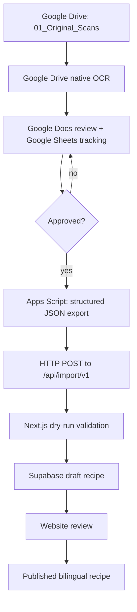
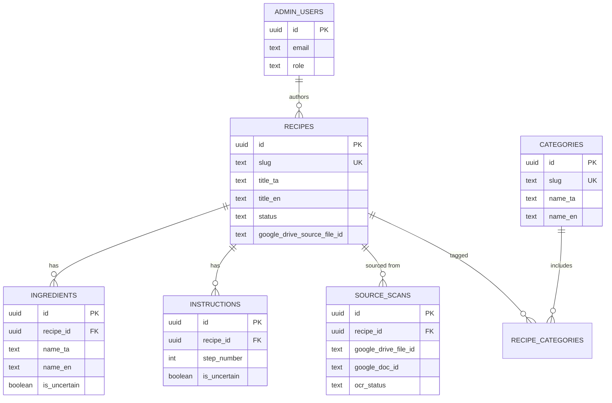

# Architecture Overview

This document is the entry point into the project's architecture. It summarizes the system as
defined in `CLAUDE.md` and links out to the detailed reference documents. If anything here
conflicts with `CLAUDE.md`, `CLAUDE.md` wins — this file is a readable summary, not a second
source of truth.

## 1. Two-layer system

The project has two connected layers:

1. **Google Workspace content pipeline** — source storage, OCR coordination, Tamil
   proofreading, English translation, recipe review, and approved-content export.
2. **Next.js public recipe website** — bilingual public pages, admin dashboard, and the
   Supabase-backed database.

The two layers are connected by a single controlled interface: an approved JSON export pushed
from Apps Script to a Next.js import endpoint. There is no live two-way sync.

## 2. Data boundary / content flow



Rules that keep this boundary safe (see `CLAUDE.md` §5):

- Never build live two-way synchronization for MVP.
- Sheet/Doc edits never modify a published recipe directly — only an approved export can.
- Unreviewed OCR or machine translation never reaches the website.

## 3. Technology stack

**Public website:** Next.js (App Router), TypeScript, Tailwind CSS, Supabase (Postgres, Storage,
Auth, generated types), Vercel, ESLint, Prettier, Vitest, Zod.

**Content pipeline:** Google Drive, Google Sheets, Google Docs, Google Apps Script.

See `CLAUDE.md` §3 for the full approved list, including what is explicitly excluded (Prisma,
additional CMS).

## 4. OCR method — resolved inconsistency

`CLAUDE.md` §9, §11, and §34 describe **Google Cloud Vision** as the approved OCR provider.
However, a later addendum appended to the end of `CLAUDE.md` ("Google Drive OCR Implementation")
supersedes that decision and requires `OcrWorkflow.gs` to use the **Google Advanced Drive Service
for native OCR** instead, with Cloud Vision configuration kept only as a documented-but-unused
fallback path (§11 is retained in case a future decision reintroduces it).

**This is flagged here explicitly so it isn't silently lost.** All Stage 2 documentation and
Apps Script scaffolding in this repository follow the **Drive-native OCR** path:

```
Google Drive native OCR (Advanced Drive Service v2, ocrLanguage: "ta")
  → structured bilingual Google Doc
  → Google Sheets approval
  → Apps Script structured JSON export
  → HTTP POST to /api/import/v1
```

If Cloud Vision is reintroduced later, `CLAUDE.md` §9/§11 should be reconciled with the addendum
and this section updated to match.

## 5. Component responsibilities

| Component          | Owns                                                                                                              |
| ------------------ | ----------------------------------------------------------------------------------------------------------------- |
| Google Drive       | Original scans, OCR output docs, review docs, translation docs, approved JSON exports, private backups            |
| Google Sheets      | Processing status, import tracking, ingredient/instruction staging, categories, review notes, error tracking      |
| Google Docs        | Human-readable Tamil proofreading, English translation review, approval record                                    |
| Google Apps Script | Scan detection, OCR coordination, Doc template creation, Sheet updates, notifications, JSON export, error logging |
| Supabase           | Approved recipes, ingredients, instructions, categories, public images, admin users, search                       |
| Next.js            | Public bilingual pages, locale routing, admin dashboard, import validation, SEO metadata                          |

Full detail: `CLAUDE.md` §4.

## 6. Database schema (summary)

Full column lists live in `CLAUDE.md` §13–§15. A dedicated `docs/database-schema.md` with
migration SQL is planned for the Supabase implementation stage — this is a summary only.



`source_scans` is the audit trail linking a published recipe back to its private Google Drive
source — it stores Drive/Doc IDs, never the private files themselves.

## 7. Reference documents

- [`google-workspace-setup.md`](./google-workspace-setup.md) — manual setup steps
- [`drive-folder-structure.md`](./drive-folder-structure.md) — Drive folder purposes and rules
- [`sheet-schema.md`](./sheet-schema.md) — full Sheets workbook column reference
- [`google-doc-template.md`](./google-doc-template.md) — review Doc template and fill rules
- [`translation-glossary.md`](./translation-glossary.md) — Tamil↔English term glossary
- [`import-export-format.md`](./import-export-format.md) — JSON export contract and HTTP delivery

## 8. Milestones

See `CLAUDE.md` §33 for the full M0–M7 milestone plan. This stage (documentation + Apps Script
scaffold with placeholders) corresponds to the documentation portion of **M5 — Google Workspace
Pipeline**, without live deployment, credentials, or the Next.js import endpoint — those remain
future stages per §35 (Decisions Requiring Approval).
