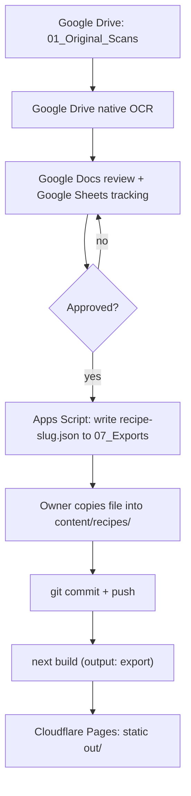

# Architecture Overview

This document is the entry point into the project's architecture. It summarizes the system as
defined in `CLAUDE.md` and links out to the detailed reference documents. If anything here
conflicts with `CLAUDE.md`, `CLAUDE.md` wins — this file is a readable summary, not a second
source of truth.

**Revision history that matters for reading the rest of this repo:** the project briefly used
Supabase (Postgres + Auth + Storage) as its database. It has since moved to a static-export
architecture with **no database at all** — content lives in `content/*.json`, committed to git.
`supabase/` is kept only as archived reference (`supabase/README.md`); nothing in the live site
imports a Supabase client.

## 1. Two-layer system

The project has two connected layers:

1. **Google Workspace content pipeline** — source storage, OCR coordination, Tamil
   proofreading, English translation, recipe review, and approved-content export.
2. **Next.js static site** — bilingual public pages, built entirely from local JSON content and
   deployed as static files. No server, no database, no admin dashboard.

The two layers are connected by a **file**, not an API: Apps Script writes an approved recipe as
JSON to Google Drive, and a human copies that file into `content/recipes/` in this repository.
There is no live sync of any kind, automated or otherwise.

## 2. Content flow



Rules that keep this boundary safe:

- Never build live two-way synchronization.
- Sheet/Doc edits never affect the live site directly — only a committed file in
  `content/recipes/` does.
- Unreviewed OCR or machine translation never reaches `content/`, because the export gate in
  `ExportApproved.gs` only writes files for recipes that have cleared Tamil review, translation
  review, and uncertainty resolution.
- Un-publishing a recipe means deleting its file, not flipping a status flag — there is no
  draft/published distinction inside `content/`; presence in that directory _is_ "published."

## 3. Technology stack

**Public website:** Next.js (App Router, `output: "export"`), TypeScript, Tailwind CSS,
Cloudflare Pages, ESLint, Prettier, Vitest.

**Content pipeline:** Google Drive, Google Sheets, Google Docs, Google Apps Script.

**Explicitly not used:** Supabase, Postgres, Prisma, any server runtime or API route, any
database-backed admin panel. See `docs/cloudflare-pages-deployment.md` for the build/deploy
settings and section 7 below for what this trade-off actually costs.

## 4. OCR method — resolved inconsistency (unaffected by the database change)

`CLAUDE.md` §9, §11, and §34 describe **Google Cloud Vision** as the approved OCR provider.
However, a later addendum appended to the end of `CLAUDE.md` ("Google Drive OCR Implementation")
supersedes that decision and requires `OcrWorkflow.gs` to use the **Google Advanced Drive Service
for native OCR** instead. This project follows the addendum:

```
Google Drive native OCR (Advanced Drive Service v2, ocrLanguage: "ta")
  → structured bilingual Google Doc
  → Google Sheets approval
  → Apps Script writes <slug>.json to Drive
  → owner copies it into content/recipes/ and commits
```

## 5. Component responsibilities

| Component          | Owns                                                                                                              |
| ------------------ | ----------------------------------------------------------------------------------------------------------------- |
| Google Drive       | Original scans, OCR output docs, review docs, translation docs, exported recipe JSON files, private backups       |
| Google Sheets      | Processing status, ingredient/instruction staging, categories, review notes, error tracking                       |
| Google Docs        | Human-readable Tamil proofreading, English translation review, approval record                                    |
| Google Apps Script | Scan detection, OCR coordination, Doc template creation, Sheet updates, notifications, JSON export, error logging |
| `content/*.json`   | The site's entire dataset — recipes and categories, committed to git                                              |
| Next.js            | Reads `content/*.json` at build time, renders every locale/recipe/category page statically                        |
| Cloudflare Pages   | Hosts the static build, redeploys automatically on push                                                           |

## 6. Content shape

Types: `src/types/recipe.ts`, `src/types/category.ts`. Full field-by-field reference:
`docs/import-export-format.md` (this doubles as both "what Apps Script writes" and "what the
content loader reads" — they must match exactly). Loader: `src/lib/content/loader.ts`.

Field names deliberately mirror the old Supabase column names (`title_ta`, `title_en`,
snake_case throughout) even without a database behind them — that's what let the public pages
and components survive the pivot with only import-path changes.

## 7. What dropping the database actually costs

- Publishing latency: a rebuild/redeploy (minutes), not an instant write.
- No server-side search or arbitrary filtering — only what's feasible to compute in-memory over
  the full local content set at build time. Fine at the scale of a personal recipe collection;
  wouldn't scale to a large multi-tenant site.
- No future admin edit UI without a different foundation (headless CMS, or a tool that writes
  files via the GitHub API) — Google Workspace is the permanent editing surface now, not a
  placeholder for an eventual database-backed admin.
- The `import_events` idempotency design from the Supabase era is simply unnecessary now — git
  commits are naturally idempotent.
- RLS / column-level grants are moot — everything under `content/` is public by construction, so
  there's no request-time authorization boundary to enforce. This is _not_ a regression:
  `is_uncertain`/`uncertainty_notes` are now never written to a public file at all, which is a
  stronger guarantee than actively hiding a database column.

## 8. Reference documents

- [`google-workspace-setup.md`](./google-workspace-setup.md) — manual setup steps
- [`drive-folder-structure.md`](./drive-folder-structure.md) — Drive folder purposes and rules
- [`sheet-schema.md`](./sheet-schema.md) — full Sheets workbook column reference
- [`google-doc-template.md`](./google-doc-template.md) — review Doc template and fill rules
- [`translation-glossary.md`](./translation-glossary.md) — Tamil↔English term glossary
- [`import-export-format.md`](./import-export-format.md) — the `content/recipes/*.json` contract
- [`cloudflare-pages-deployment.md`](./cloudflare-pages-deployment.md) — build/deploy settings
- [`database-schema.md`](./database-schema.md) — **archived**, Supabase-era reference only

## 9. Milestones

`CLAUDE.md` §33's M0–M7 plan predates this pivot and no longer matches reality in places (M1
"Supabase Database and Auth" and M6 "Website Import" in particular). Treat it as historical intent
rather than a current roadmap until it's revised.
