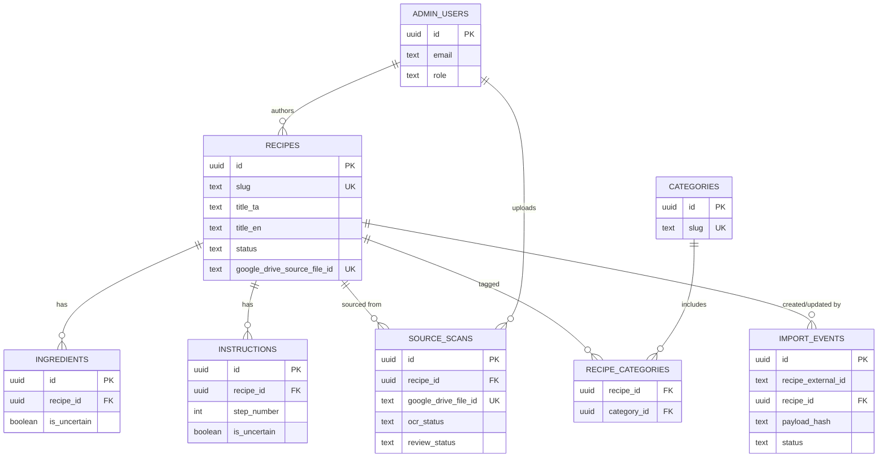

# Database Schema

Source of truth for table/column intent: `CLAUDE.md` §13–§15. Migration:
`supabase/migrations/0001_init.sql`. Seed data: `supabase/seed.sql`. This document explains the
schema and the design decisions `CLAUDE.md` leaves open — if the migration and this document ever
disagree, the migration is correct and this document is stale and needs updating.

## Entity relationships



## Tables

### `admin_users`

| Column       | Type          | Notes                                                                                                                    |
| ------------ | ------------- | ------------------------------------------------------------------------------------------------------------------------ |
| `id`         | `uuid` PK     | References `auth.users(id)` — a row here only exists once someone has a real Supabase Auth account. `ON DELETE CASCADE`. |
| `email`      | `text`        |                                                                                                                          |
| `role`       | `admin_role`  | `owner` \| `editor`, default `editor`                                                                                    |
| `created_at` | `timestamptz` |                                                                                                                          |

`CLAUDE.md` §13 lists no `updated_at` for this table — followed exactly, so role changes are not
timestamped. No policies grant `anon`/`authenticated` any access to this table.

### `categories`

| Column                             | Type            | Notes                                                      |
| ---------------------------------- | --------------- | ---------------------------------------------------------- |
| `id`                               | `uuid` PK       |                                                            |
| `slug`                             | `text` UK       | Must match the Sheet's `category_slug` (`sheet-schema.md`) |
| `name_ta`, `name_en`               | `text` NOT NULL |                                                            |
| `description_ta`, `description_en` | `text`          |                                                            |
| `created_at`, `updated_at`         | `timestamptz`   | `updated_at` trigger-maintained                            |

Publicly readable, unconditionally.

### `recipes`

| Column                                                                     | Type                                            | Notes                                     |
| -------------------------------------------------------------------------- | ----------------------------------------------- | ----------------------------------------- |
| `id`                                                                       | `uuid` PK                                       |                                           |
| `slug`                                                                     | `text` UK NOT NULL                              |                                           |
| `title_ta`, `title_en`                                                     | `text` NOT NULL                                 |                                           |
| `description_ta`, `description_en`                                         | `text`                                          |                                           |
| `source_page_number`                                                       | `int`                                           |                                           |
| `prep_time_minutes`, `cook_time_minutes`, `total_time_minutes`             | `int`                                           |                                           |
| `servings`                                                                 | `int`                                           |                                           |
| `difficulty`                                                               | `recipe_difficulty`                             |                                           |
| `featured_image_url`                                                       | `text`                                          | Supabase Storage URL — never a Drive link |
| `status`                                                                   | `recipe_status` NOT NULL                        | default `draft`                           |
| `seo_title_ta`, `seo_title_en`, `seo_description_ta`, `seo_description_en` | `text`                                          |                                           |
| `google_drive_source_file_id`                                              | `text` UK, nullable                             | Import idempotency key — see below        |
| `created_by`, `updated_by`                                                 | `uuid` → `admin_users.id`, `ON DELETE SET NULL` |                                           |
| `published_at`                                                             | `timestamptz`                                   |                                           |
| `created_at`, `updated_at`                                                 | `timestamptz`                                   | `updated_at` trigger-maintained           |

Publicly readable only where `status = 'published'`. `google_drive_source_file_id` is additionally
column-revoked from `anon`/`authenticated` even on published rows (see RLS section).

### `ingredients` / `instructions`

Both follow `CLAUDE.md` §13 exactly, including the fact that neither table has timestamp columns
— they're expected to be wholesale-replaced per recipe on each import rather than edited row by
row, so per-row timestamps wouldn't mean much.

`instructions` has both `step_number` (the number shown to the reader, e.g. "Step 3") and
`display_order` (the sort key) — CLAUDE.md §13 lists both explicitly; they're allowed to diverge
if a recipe is ever reordered without renumbering. `UNIQUE (recipe_id, step_number)` and
`UNIQUE (recipe_id, display_order)` prevent duplicate ordering within one recipe, supporting the
"check ingredient/instruction order" rule in §22.

Publicly readable, but only rows belonging to a published recipe, and only via a query that names
its columns explicitly — see "Column-level grants" below for why `uncertainty_notes` isn't
reachable through `select('*')`.

### `recipe_categories`

Plain many-to-many join table, `(recipe_id, category_id)` composite primary key, both FKs
`ON DELETE CASCADE`. Publicly readable only for published recipes.

### `source_scans`

| Column                     | Type                                            | Notes                                                                                                                                                 |
| -------------------------- | ----------------------------------------------- | ----------------------------------------------------------------------------------------------------------------------------------------------------- |
| `id`                       | `uuid` PK                                       |                                                                                                                                                       |
| `recipe_id`                | `uuid` → `recipes.id`, `ON DELETE SET NULL`     |                                                                                                                                                       |
| `page_number`              | `int`                                           |                                                                                                                                                       |
| `image_url`                | `text`                                          | A **private Drive view-link**, for the admin's own reference (§21) — never a Supabase Storage URL. Scans are never duplicated into Storage (§6, §23). |
| `google_drive_file_id`     | `text` NOT NULL, UK                             | One row per scanned file                                                                                                                              |
| `google_doc_id`            | `text`                                          | The review Doc's ID                                                                                                                                   |
| `ocr_provider`             | `text`                                          | Free text — currently always `google_drive_native_ocr` once populated (see "OCR provider" note below)                                                 |
| `ocr_raw_text`             | `text`                                          |                                                                                                                                                       |
| `ocr_status`               | `scan_ocr_status` NOT NULL                      | default `pending`                                                                                                                                     |
| `corrected_text_ta`        | `text`                                          |                                                                                                                                                       |
| `review_status`            | `source_scan_review_status` NOT NULL            | default `pending` — **not specified anywhere in `CLAUDE.md`**, see "Gaps resolved" below                                                              |
| `uploaded_by`              | `uuid` → `admin_users.id`, `ON DELETE SET NULL` |                                                                                                                                                       |
| `created_at`, `updated_at` | `timestamptz`                                   | trigger-maintained                                                                                                                                    |

No public policy at all — this table is entirely invisible to `anon`/`authenticated`, satisfying
"do not expose raw OCR text / source scans publicly" at the strongest possible level (the rows
simply don't exist as far as a public query is concerned).

### `import_events`

Not in `CLAUDE.md` §13 — added for this stage per explicit request, to support import
idempotency. Nothing currently writes to this table; `/api/import/v1` is a future stage.

| Column                                         | Type                                        | Notes                                                    |
| ---------------------------------------------- | ------------------------------------------- | -------------------------------------------------------- |
| `id`                                           | `uuid` PK                                   |                                                          |
| `recipe_external_id`                           | `text` NOT NULL                             | The Workspace `recipeId`, e.g. `recipe-0001`             |
| `recipe_id`                                    | `uuid` → `recipes.id`, `ON DELETE SET NULL` | Set once matched/created                                 |
| `source_drive_file_id`, `source_google_doc_id` | `text`                                      | Mirrors the payload's `source.*`                         |
| `payload`                                      | `jsonb` NOT NULL                            | The full raw import payload, for audit/debugging         |
| `payload_hash`                                 | `text` NOT NULL                             | Hash of the canonical payload — see idempotency strategy |
| `status`                                       | `import_event_status` NOT NULL              | `received` \| `applied` \| `rejected` \| `failed`        |
| `status_reason`                                | `text`                                      |                                                          |
| `received_at`, `processed_at`                  | `timestamptz`                               |                                                          |

No public policy — service-role only, same as `source_scans`.

## Enums

```text
recipe_status:              draft | review | published | archived
recipe_difficulty:          easy | medium | hard
scan_ocr_status:             pending | processing | extracted | failed | corrected | verified
admin_role:                  owner | editor
source_scan_review_status:   pending | approved                      -- added, see below
import_event_status:         received | applied | rejected | failed  -- added, see below
```

The first four are `CLAUDE.md` §14, verbatim. The last two fill gaps `CLAUDE.md` doesn't cover.

## RLS strategy

No table has an `INSERT`/`UPDATE`/`DELETE` policy for `anon` or `authenticated`. Every mutation —
admin recipe edits, the future import endpoint — goes through `src/lib/supabase/admin.ts` (the
service-role client, which bypasses RLS) after an application-level authorization check confirms
the caller is a real admin. This matches `CLAUDE.md` §15 ("use server-side Supabase clients for
privileged operations") and §27 (`admin.ts` is service-role only).

RLS only ever grants reads:

| Table                                              | Public read condition                          |
| -------------------------------------------------- | ---------------------------------------------- |
| `categories`                                       | unconditional                                  |
| `recipes`                                          | `status = 'published'`                         |
| `ingredients`, `instructions`, `recipe_categories` | parent recipe is published (`EXISTS` subquery) |
| `admin_users`, `source_scans`, `import_events`     | **no policy** — default-deny                   |

### Column-level grants (defense in depth)

RLS is row-level only — it can't hide one column while allowing the rest of the same row. Since
`ingredients`/`instructions` rows for a published recipe _are_ publicly readable, `uncertainty_notes`
needs a second layer:

```sql
revoke select (uncertainty_notes) on ingredients from anon, authenticated;
revoke select (uncertainty_notes) on instructions from anon, authenticated;
revoke select (google_drive_source_file_id) on recipes from anon, authenticated;
```

**Important consequence:** a public query that does `select('*')` on `ingredients`, `instructions`,
or `recipes` will get a Postgres permission-denied error, not a silently-trimmed row. This is the
intended safe failure mode — it forces every public-facing query (future `lib/recipes/queries.ts`)
to name its columns explicitly rather than relying on the caller to remember not to select the
sensitive one.

## Import idempotency strategy

The export payload (`import-export-format.md`) has no request-level nonce, and `recipes` has no
column for the Workspace `recipeId` string. The natural stable key is
`recipes.google_drive_source_file_id` — already part of `CLAUDE.md` §13, made `UNIQUE` here.
Postgres allows multiple `NULL`s in a unique column, so recipes never created via the Workspace
pipeline don't collide with each other.

Strategy for the future `/api/import/v1` (**documented here, not implemented this stage**):

1. Compute `payload_hash` from the canonical JSON body. Insert an `import_events` row immediately
   with `status = 'received'`.
2. If the most recent `import_events` row for the same `recipe_external_id` already has
   `status = 'applied'` with the _same_ `payload_hash`, this is a pure retry of already-applied
   content (e.g. Apps Script retrying after a lost HTTP response) — return the previous result
   without touching `recipes`/`ingredients`/`instructions` again.
3. Otherwise, look up `recipes` by `google_drive_source_file_id`:
   - **No match** — validate per §22 → insert a new `draft` recipe + children → mark the event
     `applied`.
   - **Match, `status` is `draft`, `review`, or `archived`** — validate → replace the recipe's
     `ingredients`/`instructions` and update its row → mark the event `applied`. This is what
     lets the owner re-export after fixing something in the Doc/Sheet.
   - **Match, `status = 'published'`** — reject. "Never overwrite a published recipe
     automatically" (§22). Mark the event `rejected`.
4. Any schema or business-rule failure (§22's reject conditions) → mark the event
   `failed`/`rejected` with a reason in `status_reason`, and don't touch `recipes` at all.

## Gaps resolved (not specified in `CLAUDE.md`)

1. **`source_scans.review_status` has no enum defined anywhere in `CLAUDE.md`.** Resolved as
   `pending | approved` — set to `approved` from the payload's `approval` object once a future
   import runs; `pending` otherwise.
2. **`import_events` doesn't exist in `CLAUDE.md` §13 at all.** Added specifically to make the
   idempotency strategy above possible without adding a "Workspace recipe ID" column to `recipes`
   that `CLAUDE.md` never specified.
3. **`source_scans` columns the export payload can't fill.** `ocr_provider`, `ocr_raw_text`,
   `corrected_text_ta`, `uploaded_by` have no counterpart in `import-export-format.md`'s JSON — the
   payload only carries `driveFileId`/`sourcePageNumber`/`googleDocId`. They stay nullable;
   populating them is a separate future concern (Workspace-side write-back or manual admin entry),
   not something the JSON import alone can do.
4. **OCR provider.** `source_scans.ocr_provider` is free text, not an enum, so it accommodates
   whichever OCR method actually ran. Per the already-resolved decision in `architecture.md` §4,
   the value written here will be `google_drive_native_ocr`, not `google_cloud_vision`, once
   anything populates it.

## Regenerating types

`src/lib/supabase/database.types.ts` is hand-written to match the migration above, in the same
shape the Supabase CLI would produce. Once a real Supabase project exists (`CLAUDE.md` M1),
regenerate it instead of hand-editing further:

```bash
supabase gen types typescript --project-id <id> > src/lib/supabase/database.types.ts
```

Application code should import from `src/types/database.ts` (ergonomic aliases), not directly
from `database.types.ts` — see that file's header comment.
